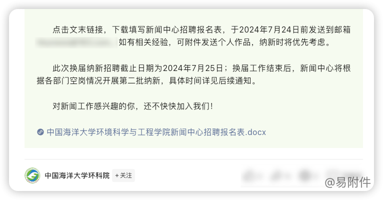

# 中国海洋大学环科院 ｜ 用户案例

### 微信公众号简介

所属单位：中国海洋大学环境科学与工程学院  
简介：中国海洋大学环境科学与工程学院官方公众号，致力于传播环境科学知识，展示学院风采，促进学术交流与创新。  

账号主要发布内容：

- 中国海洋大学校园动态及重要通知
- 环境科学与工程学院学术讲座、科研成果及项目进展
- 实习、就业机会及校友职业发展追踪
- 环境保护相关的前沿科技新闻及行业趋势分析
- 学生社团活动、校园文化展示及竞赛信息

### 使用场景

中国海洋大学环科院公众号近期发布了一篇题为环科院新闻中心2024年春季换届纳新公告的文章。该文章旨在吸引有志于新闻传播和媒体运营的优秀学生加入学院新闻中心团队。

文章内容主要包括：
- 新闻中心简介：介绍了新闻中心的职能、发展历程及其在学院宣传工作中的重要作用。
- 招聘岗位详情：详细列举了各招聘岗位的要求
- 应聘条件：说明了应聘学生需具备的基本素质和技能要求。
- 选拔流程：概述了报名、初选、面试、培训等环节的时间安排。

为了提高用户体验并简化报名流程，运营团队巧妙地运用了易附件的附件"直达链接"功能。

通过在文章中嵌入易附件生成的链接，读者可以直接浏览、下载或在线填写招聘报名表，大大提高了报名效率。

这种创新的做法不仅体现了公众号运营的专业性，也展示了学院与时俱进、拥抱新技术的态度。

<!--@include: ./case_footer.md-->

