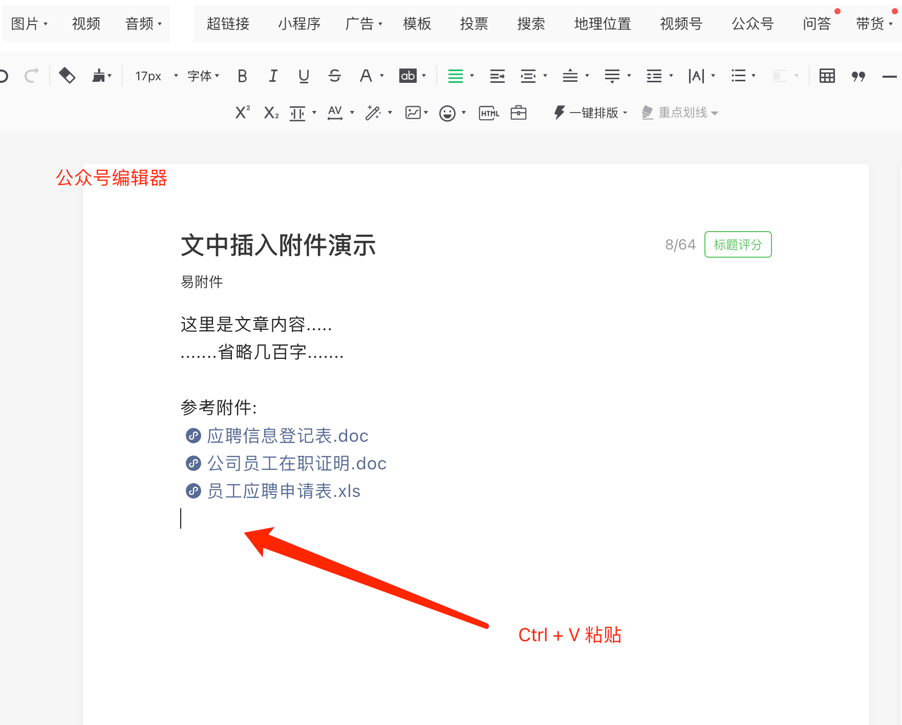

# 快速上手

以在公众号文章中添加附件为例，演示整个操作流程。只需要3步：上传，复制，粘贴。

### 上传文件 

点击上方"上传文件"按钮，选择附件上传，上传成功后列表中将出现文件记录

### 复制链接 

点击"直达链接"一栏的"复制"按钮，复制附件的"直达链接"，注意是**直达链接**

### 粘贴链接 

把鼠标光标放在合适的位置，将复制的直达链接粘贴到公众号文章编辑器

🎉 最后，重要的推文请务必预览后再发布。

### 其他常见用法
- 1、[关键字回复附件](/guide/reply-file-by-keywords.md)
- 2、[自定义菜单添加附件](/guide/reply-file-by-keywords.md)